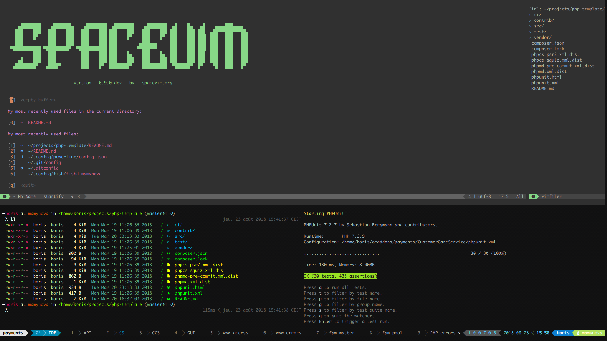

# dotfiles-work

My dotfiles @work for dev

## manjaro (archlinux)

## deepin-wm

## guake + tmux + powerline + tmuxp + tmux-tpm

## fish + fisherman + oh-my-fish + neolambda

## atom

My Atom config can be restored from [this gist](https://gist.github.com/mamyn0va/f296ef0c90e040c988ce0e9d055919ec) using sync-settings package.

## neovim + spacevim + powerline + vim-plug

## cargo + composer + gem + pip + npm + ghc-pkg + pacman

